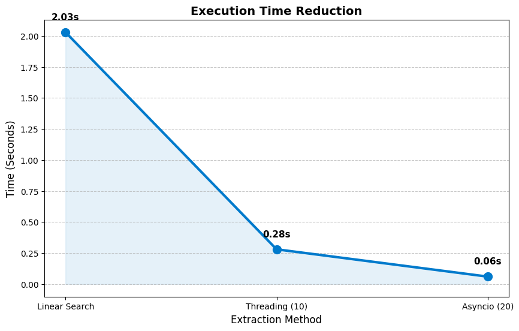
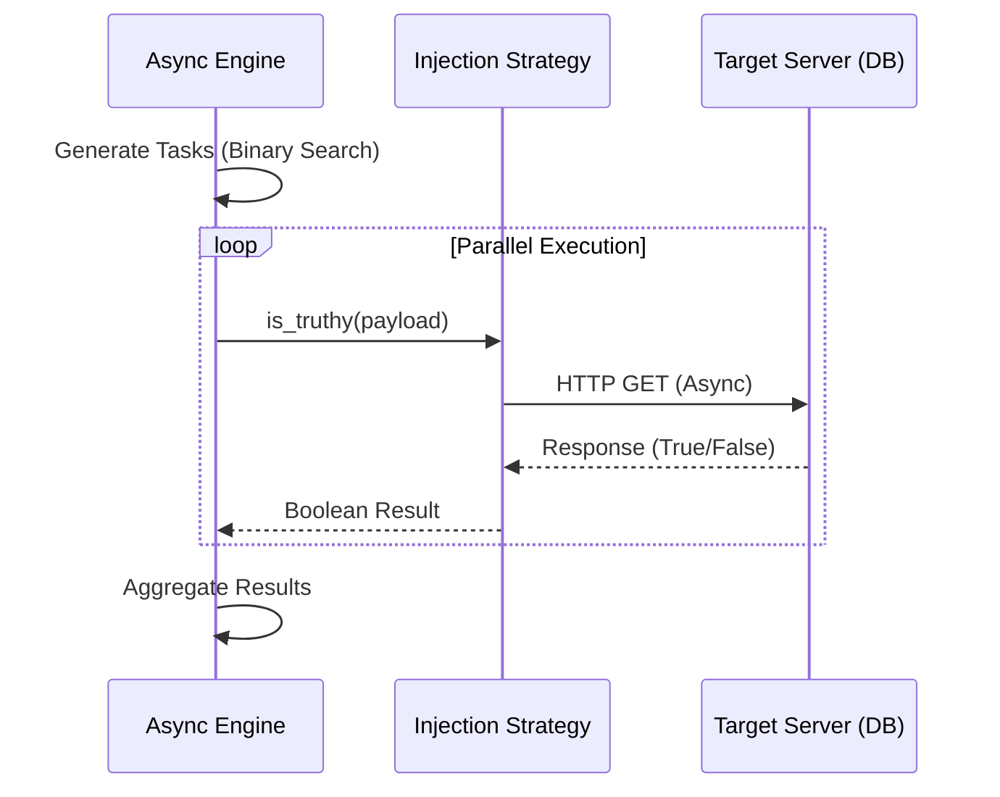

# BlindSeeker (High-Performance Async SQLi Tool)
 <p align="center">
   A high-performance, asynchronous Blind SQL Injection tool developed to study advanced exploitation techniques.
 </p>

**BlindSeeker** demonstrates how Computer Science algorithms can optimize security assessments. By replacing traditional linear extraction with a **Binary Search Algorithm $O(\log n)$** and utilizing **Non-blocking I/O** (`asyncio`), this tool achieves a extraction throughput of over **450 requests/second** in local benchmarks.

 > [!CAUTION]
 > **FOR EDUCATIONAL PURPOSES ONLY.** This project was created to demonstrate the application of algorithms and asynchronous programming in cybersecurity. The author is not responsible for any misuse.
---

### ⚡ Key Features
* **High Performance:** Utilizes `aiohttp` for efficient, non-blocking HTTP requests.
* **Algorithm Implementation:** Applies Binary Search to reduce request count by over 90%.
* **Clean Architecture:** Built using the **Strategy Design Pattern** (OOP) for modularity and maintainability.
* **Stability Control:** Includes `Semaphore` based rate-limiting to manage request concurrency.
* **Automated Testing:** Includes unit tests integrated with **GitHub Actions CI/CD.**

### 📊 Performance Benchmark
Tested on a local lab environment (Docker/DVWA).
| Method | Algorithm | Concurrency Model | Time Taken | Throughput |
| :--- | :--- | :--- | :--- | :--- |
| Linear Search | $O(n)$ | Synchronous | ~2.03s | ~15 req/s |
| Binary Search | $O(\log n)$ | Threading (10 threads) | ~0.28s | ~89 req/s |
| **BlindSeeker Pro** | **$O(\log n)$** | **Asyncio (20 tasks)** | **~0.06s** | **~465 req/s 🚀** |




### 🧩 Architecture
The tool uses an asynchronous event loop to manage concurrent tasks efficiently.


### 🛠️ Installation
**1. Clone the repository:**
```bash
git clone https://github.com/supakan0409/BlindSeeker.git
cd BlindSeeker
```
**2. Install dependencies:**
```bash
pip install -r requirements.txt
```

### 💻 Usage
Run the tool using the command line interface:
```bash
python blind_seeker2.py -u "TARGET_URL" -c "COOKIE_STRING"
```
#### Arguments
* `-u, --url` (Required): The target URL containing the Blind SQL Injection vulnerability.
* `-c, --cookie` (Required): Authenticated session cookies (e.g., `"PHPSESSID=xyz; security=low"`).
* `-s, --success` (Optional): The string indicating a TRUE query result (Default: `"User ID exists"`).
* `-t,` --concurrency (Optional): Max concurrent requests (Default: `20`).

#### Example
```bash
python blind_seeker_pro.py -u "http://localhost/vulnerabilities/sqli_blind/" -c "PHPSESSID=your_session_id_here; security=low" -t 50
```

### 🚀 Development & Testing
This project maintains code quality using pytest. To run the automated test suite (including mock strategies):
```bash
pytest test_blind_seeker.py -v
```

---
**Developed by Supakan | © 2026 Academic Research Project | All Rights Reserved.**